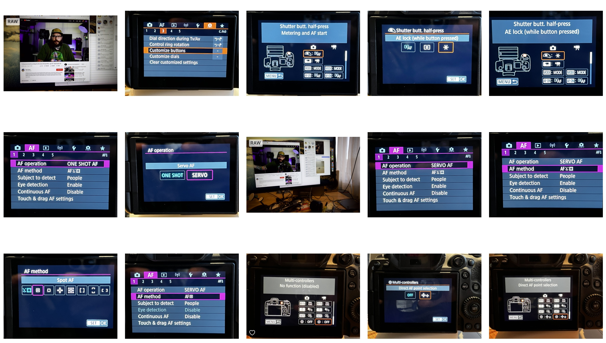
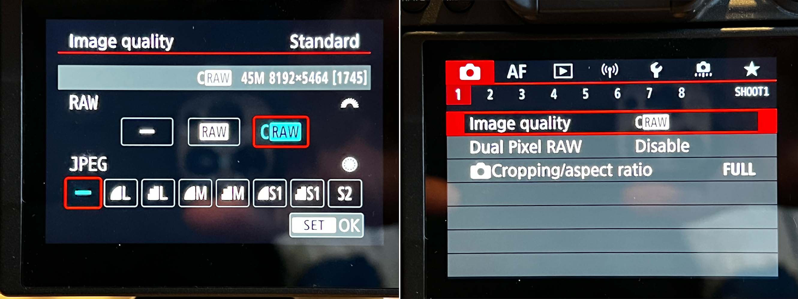

# 📷 EOS R5 settings

These are my EOS R5 camera settings.

NOTE: After loading settings from card, turn camera off and on to avoid random fuckery.

## History

### 2022-02-06 → CAMSET03.CSD → Baby got BACK (button focus)

Implemented [Brett Carlsen](https://www.youtube.com/channel/UCv8214tuW1Z7W-T1kZAXMug)'s "[Professional Autofocus Setup for the Canon R5 (and R6) - eye AF + back button AF](https://youtu.be/sqLQ-TzwCis)".

And **also** set the joystick ("multi-controllers" 🤔) to control the AF point (instead of the default behavior of **doing fucking nothing** (!!! (🤯)) while shooting. (I think Brett just forgot this was the default, already having it set, and thus didn't show it in his video.)

- `C.Fn3` → `Customize buttons`

    - `Shutter butt. half-press` → `*` (`AE lock (while button pressed)`)

- `AF1`

    - `AF operation` → `SERVO`

    - `AF method` → `Spot AF`

- `C.Fn3` → `Customize buttons` (again)

    - `Multi-controllers` → `Direct AF point selection`

     
### 2022-02-06 → CAMSET02.CSD → RAW, dog.

- `SHOOT1` → `Image Quality`

    - `RAW` → `C-RAW`

    - `JPEG` → `-` (meaning "off")

    

### 2022-02-06 → CAMSET01.CSD

These are the default settings. I used the `Reset Camera` function in the camera UI to reset all of the settings to default, to provide a starting point for customization.

以上
